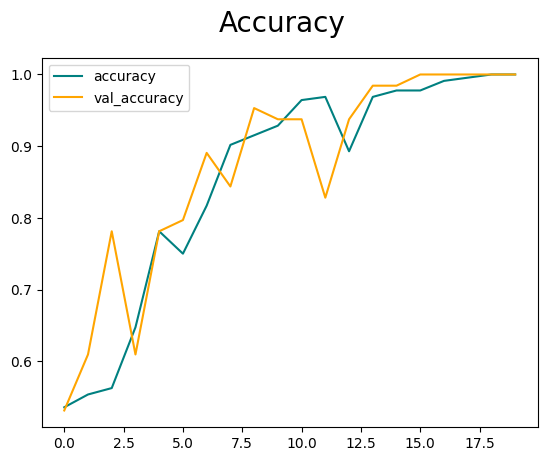

# Binary Image Classification
Image classifier with a convolutional neural network in TensorFlow with any dataset. In my example I trained a model with images of happy and sad people

## Steps
 
<b>Step 1.</b> Clone this repository
<pre>
git clone https://github.com/schehat/automatic_number_plate_recognition
</pre>
  
<b>Step 2.</b> Create a new virtual environment 
<pre>
python -m venv anpr
</pre> 
 
<b>Step 3.</b> Activate your virtual environment
<pre>
.\anpr\Scripts\activate # Windows 
</pre>
 
<b>Step 4.</b> Install dependencies and add virtual environment to kernel
<pre>
pip install -r /path/to/requirements.txt
python -m ipykernel install --user --name=anpr
</pre>
 
<b>Optionally: training model</b>  Download images in this structure and you should be good to go. No need to split data in train and test, will be in in the notebook.

<b> data\happy</b> and
<b> data\sad</b>